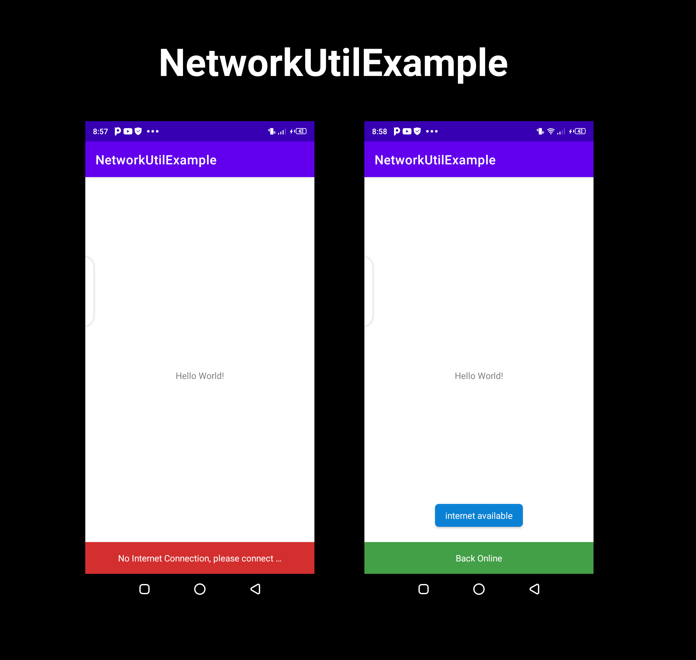

# LiveDataNetworkUtil
A simple Android Livedata network library.



#### [View Releases and Changelogs](https://github.com/ma-za-kpe/LiveDataNetworkUtil/releases)

[](https://github.com/ma-za-kpe/LiveDataNetworkUtil/actions?query=workflow%3ACI)
[](https://opensource.org/licenses/Apache-2.0)

# Modules

The networkUtil module is the fundamental module that you need in order to use this library.

[](https://jitpack.io/#ma-za-kpe/LiveDataNetworkUtil)

Please note that this library only supports Kotlin.

Step 1: Add it in your root build.gradle at the end of repositories:
```
    allprojects {
    		repositories {
    			...
    			maven { url 'https://jitpack.io' }
    		}
    	}
```

Step 2: Add the dependency

```gradle
    dependencies {
	        implementation 'com.github.ma-za-kpe:LiveDataNetworkUtil:0.2.1'
	}
```

# Example

```
   private fun handleNetwork() {
        NetworkUtil.getNetworkLiveData(applicationContext).observe(this, { isConnected ->
            if (!isConnected) {
                Toast.makeText(this, "no internet", Toast.LENGTH_SHORT).show()
            } else {
                Toast.makeText(this, "internet available", Toast.LENGTH_SHORT).show()
            }
        })
    }
```
- An implementation from the example project can be found [here](https://github.com/ma-za-kpe/LiveDataNetworkUtil/blob/master/app/src/main/java/com/maku/networkutilexample/MainActivity.kt)


